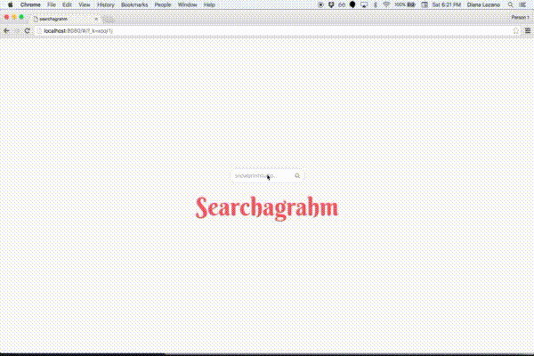

##About
Searchagrahm is a web app where the user can find an instagram username and view their 10 most recent media.

This project is in 'sandbox mode' which means that the app has limited developer API access.

##Installation

1. `git clone git@github.com:cutofmyjib/searchagrahm.git`
2. `npm install`
3. `npm start`
4.  Navigate to `http://localhost:8080/`

##More info
You can read more about this project [here](http://cutofmyjib.github.io/searchagrahm.html)

##Built with
* Semantic UI
* React
* Instagram API